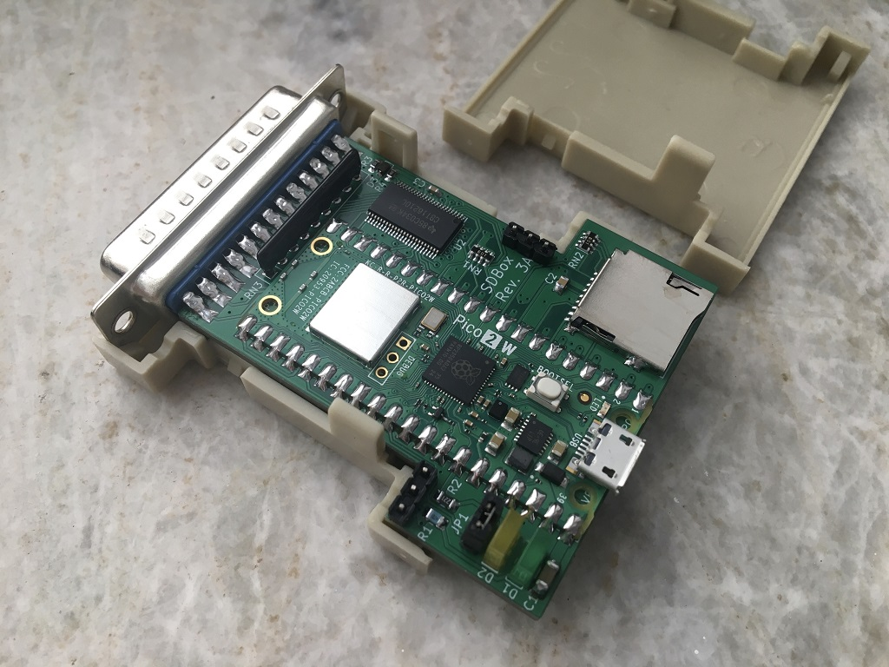
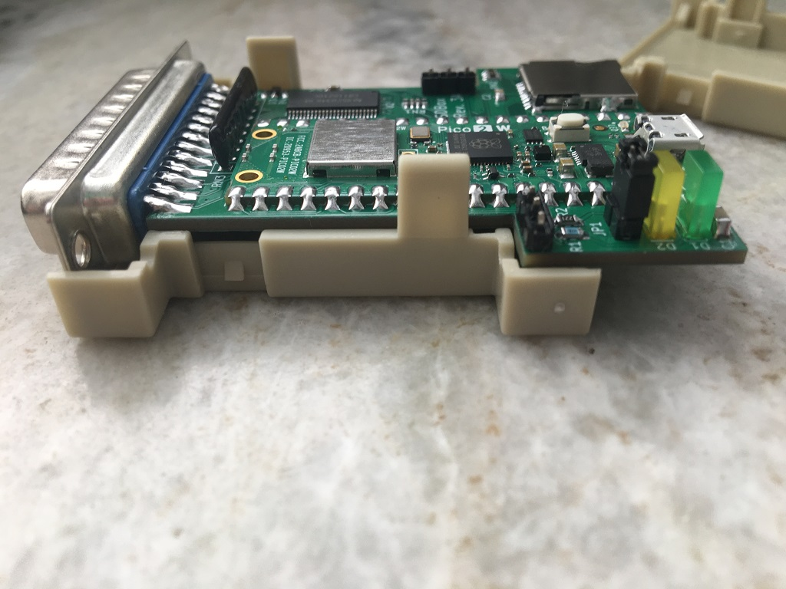
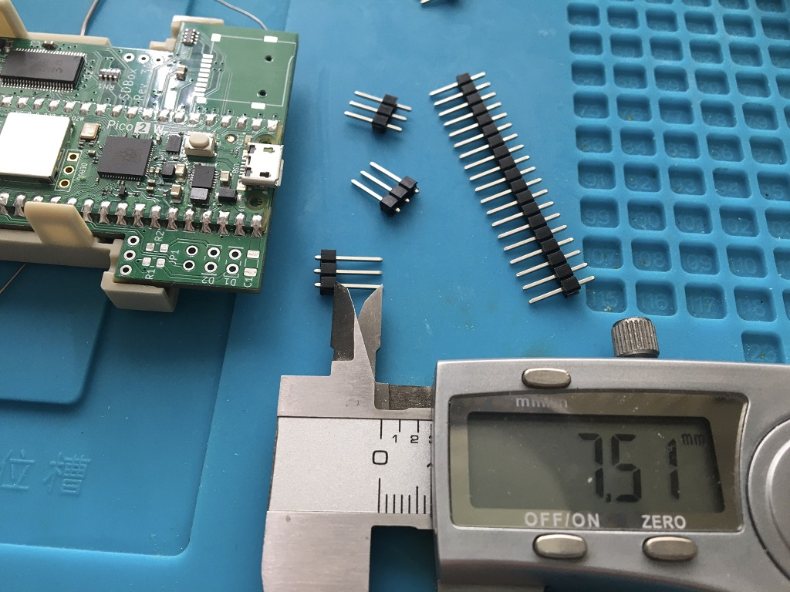
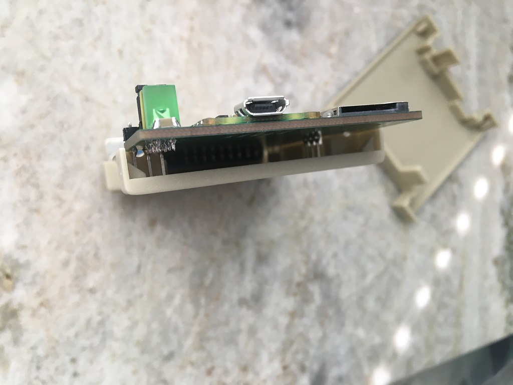

# SDBox-v3
A parallel to Pico 2 W and sd-card project for the Amiga

***

***

***

BOM Rev. 3A
---------
Reference  | Name/Value   | Package | Notes
-|-|-|-|
U1 | Raspberry Pi Pico 2 W | SC1633 (without header) | [RPi Pico 2 W](https://www.mouser.com/ProductDetail/358-SC1633)
U2 | SN74CBT16210 | TSSOP-48 6.1x12.5mm_P0.5mm | 20-BIT FET Bus switch with level shifting, high-speed TTL-compatible. [SN74CBT16210CDGGR ](https://www.mouser.com/ProductDetail/595-SN74CBT16210CDGG)
J1 | DB25_Male | DSUB-25_Male_EdgeMount_P2.77mm| DB25 Male [Aliexpress](https://www.aliexpress.com/item/1005006354086316.html)
J2 | Sunrom Micro SD Card Holder | 9-pin Micro SD card slot connector | Sunrom Micro-SD [Aliexpress](https://www.aliexpress.com/item/32802051702.html)
J3 | (Optional) UART0 PinHeader | 5-pin 2.54 mm pitch single row | Optional 5V-tolerant header for UART0 (TX on GP12, RX on GP13) 
JP1 | (Optional) PinHeader/Jumper shunt | 2-pin 2.54 mm pitch single row | Jumper on connects Amiga /RESET signal together with RUN-pin (pin 30) on Pico 2 W, resets pico on Ctrl-A-A
D1 (Optional) | LED Square 2x5x7mm | PinHeader_1x02_P2.54mm_Vertical, pin pitch 2.54 mm | Power LED indicator [Aliexpress](https://www.aliexpress.com/item/1005006220921860.html)
D2 (Optional) | LED Square 2x5x7mm | PinHeader_1x02_P2.54mm_Vertical, pin pitch 2.54 mm | Activity LED indicator [Aliexpress](https://www.aliexpress.com/item/1005006220921860.html)
D3 | MMDL6050T1G Small Signal Switching Diode 200mA | SOD-323 | [MMDL6050T1G](https://www.mouser.com/ProductDetail/863-MMDL6050T1G)
R1 (Optional) | 4.7k Ω | 0805 | (Mandatory if D1 populated) Series resistor for D1 LED, adjust R-value to your type of LED and preferred brightness
R2 (Optional) | 220 Ω | 0805 | (Mandatory if D2 populated) Series resistor for D2 LED, adjust R-value to your type of LED and preferred brightness
R3 (Optional) | 10k Ω | 0603 | Pull-up for /STROBE signal, not currently used
R4 | 2.9k - 3k Ω | 0603 | Resistor for dummy loading D3 to achieve steady 0.6-0.7V VCC drop resulting in ~4.3V power supply to U2 [CR0603-FX-2941ELF](https://www.mouser.com/ProductDetail/652-CR0603FX-2941ELF)
RN1, RN2 | CAY16-103J4LF RES ARRAY 4 Resistors 10k Ω | 1206 | [CAY16-103J4LF](https://www.mouser.com/ProductDetail/652-CAY16-103J4LF)
RN3 | A103J | Bussed Resistor Network Array SIP-9 | Pull-up resistors for data lines, 9PIN-10K [Aliexpress](https://www.aliexpress.com/item/1005006954621214.html)
C1 | Capacitor 10uF | 1206 | 
C2 | Capacitor 0.1uF = 100nF | 0805 | 
C3 | Capacitor 0.1uF = 100nF | 0603 |
Housing | 2 x Plastic Shell Cover | For DB25 plug | [Aliexpress](https://www.aliexpress.com/item/1005004717091904.html)
2 x PinHeader | PinHeader Board Weight/Level Support | 3-pin 2.54 mm pitch single row | Move the plastic guard to leave ~7.5 mm of pin before soldering in order to hold board in perfect level

***

When ordering from JLCPCB select:

Specify Layer Sequence: Yes

    L1(Top layer):    F_Cu.gbr
    L2(Inner layer1): GND_Cu.gbr
    L3(Inner layer2): VCC_Cu.gbr
    L4(Bottom layer): B_Cu.gbr

Remove Order Number: 

    Specify a location

This will notify JLC where to put the order number, they will replace the "JLCJLCJLCJLC" silkscreen label.

***
